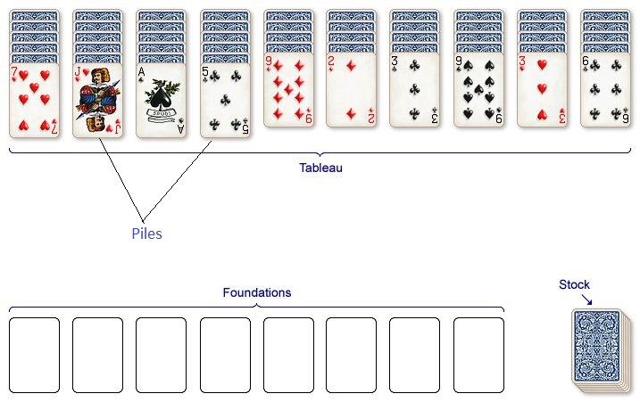

In the past few posts we designed the S4 classes `Card` and `Deck` that will form the foundation of the spider solitaire game. In this post, we will create `Game` class as well as some of its constituent components. The diagram below illustrates some of the key components of the game. From a deck of 104 cards, 10 piles are created on the tableau with the top most card in the face_up position. The remaining 50 face down cards form the stack. When the player chooses (usually when there are no remianing moves), she can deal 10 cards from the stack onto her piles.



Let's start by creating the `Game` class, which will eventually contain all the key data structures and the game rules. To start with, a game will have a list of 10 piles and a stack of cards. The `Game` constructor should take a single `difficulty` parameters as input which is used to create a `Deck` object which is then shuffled and dealt into piles.

```{r}
SEED = 1
# Game class
setClass("Game",
         slots = list(piles = "list", stack = "list"))

# Pile class
setClass("Pile", 
         slots = list(cards = "list"))

# Pile constructor
Pile <- function(cards = NULL) {
  p <- new(Class="Pile", cards = cards)
  return(p)
}


# Game constructor
Game <- function(difficulty) {
  
  difficulty_levels <- c("easy", "medium", "hard")
  if (!(difficulty %in% difficulty_levels)) stop("Unsupported Difficulty Level")
  
  if (difficulty == "easy") {
    d <- Deck(suits = c("S"), num_suits = 8)
  } else if (difficulty == "medium") {
    d <- Deck(suits = c("S", "H"), num_suits = 4)
  } else if (difficulty == "hard"){
    d <- Deck(suits = c("S", "H", "C", "D"), num_suits = 2)
  } else {
    # Should never get here
  }
  
  d <- shuffle(deck = d, seed = SEED)
  piles <- list()
  piles[[1]] <- Pile(cards = d@cards[1:6])    # <- 6 cards
  piles[[2]] <- Pile(cards = d@cards[7:12])   # <- 6 cards
  piles[[3]] <- Pile(cards = d@cards[13:18])  # <- 6 cards
  piles[[4]] <- Pile(cards = d@cards[19:24])  # <- 6 cards
  piles[[5]] <- Pile(cards = d@cards[25:29])  # <- 5 cards
  piles[[6]] <- Pile(cards = d@cards[30:34])  # <- 5 cards
  piles[[7]] <- Pile(cards = d@cards[35:39])  # <- 5 cards
  piles[[8]] <- Pile(cards = d@cards[40:44])  # <- 5 cards
  piles[[9]] <- Pile(cards = d@cards[45:49])  # <- 5 cards
  piles[[10]] <- Pile(cards = d@cards[50:54]) # <- 5 cards
  

  
  stack <- d@cards[55:104]
  
  g <- new(Class = "Game", piles = piles, stack = stack)
  print("*** CONSTRUCTOR ***")
    for ( p in g@piles) {
    cards <- getCards(p)
    last <- length(cards)
    card <- cards[[last]]
    #print(paste("YEAH = ", card))
    card@face_up <- TRUE
  }
  return(g)
}
```
